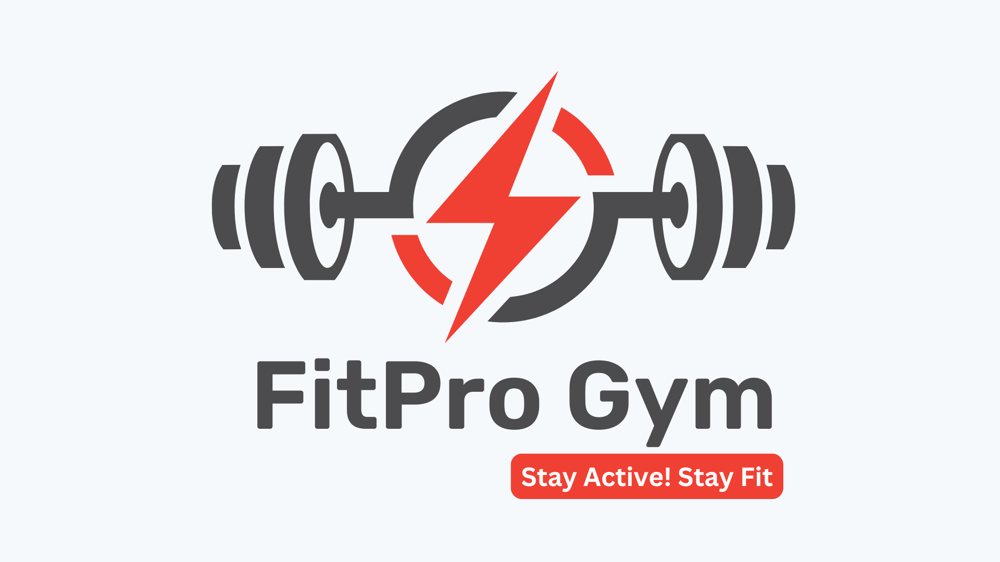

# FitPro-Gym-SQL-Project


Welcome to my first SQL project, where I analyze real-time gym data from FitPro Gym! This project uses a dataset covering gym membership and visit records to explore and analyze member behavior, answering key business questions that can help a fitness center understand its customer base better and optimize its services.

# Table of Contents
* [Introduction](#introduction)
* [Project Structure](#project-structure)
* [Database Schema](#database-schema)
* [Business Problems](#business-problems)
* [SQL Queries & Analysis](#sql-queries-&-analysis)
* [Getting Started](#getting-started)
* [Questions & Feedback](#questions-&-feedback)
* [Contact Me](#contact-me)

# Introduction
This project aims to demonstrate essential SQL skills by analyzing a dataset from FitPro Gym. Using SQL, I explored membership details, member demographics, and visit patterns to derive actionable insights. This project showcases fundamental SQL techniques, including creating tables, writing queries, and analyzing data.

# Project Structure
* **SQL Scripts**: Code to create the database schema and queries for analysis.
* **Dataset**: Real-time data on gym visits, membership, and member demographics.
* **Analysis**: SQL queries solving practical business problems, each one crafted to address specific questions.

# Database Schema
Here’s an overview of the database structure:

# 1. Members Table
* **member_id**: Unique identifier for each member
* **name**: Name of the member
# 2. Memberships Table
* **member_id**: Unique identifier linked to the `members` table
* **age**: Age of the member
* **gender**: Gender of the member ('M' or 'F')
* **membership_type**: Type of membership (e.g., Monthly, Quarterly)
* **join_date**: Date when the member joined
* **status**: Membership status (e.g., Active, Cancelled)
# 3. Visits Table
* **visit_id**: Unique identifier for each visit
* **member_id**: Linked to the `members` table
* **visit_date**: Date of the visit
* **check_in_time**: Check-in time of the visit
* **check_out_time**: Check-out time of the visit

# Business Problems
The following queries were created to solve specific business questions. Each query is designed to provide insights based on gym membership and visit data.

# Basic Filtering & Joins
1. Retrieve the name and membership_type of female members.
2. List members with a Quarterly membership aged between 20 and 30.

# Aggregation & Grouping
3. Count members by membership_type (e.g., Monthly, Weekly, Quarterly).
4. Calculate the average age of members, grouped by membership_type.

# Advanced: GROUP BY + HAVING
5. Top 3 members with the highest visits.
6. Members with more than 2 visits, sorted by total visits, displaying the top 5.
7. Members who joined in 2023, grouped by membership_type (where each group has more than 1 member).
8. Active Monthly members grouped by membership_type, showing the most recent join date and total member count.

# SQL Queries & Analysis
The `FitPro.sql` file contains all SQL queries developed for this project. Each query corresponds to a business problem above and demonstrates skills in joins, filtering, aggregation, grouping (`GROUP BY`), conditional filtering on groups (`HAVING`), and ordering.
A brief note on one of the trickier queries: for query 8 (Active Monthly members grouped by membership_type), the first attempt grouped by `member_id` in addition to `membership_type` — which meant the query wasn't actually aggregating anything, since `member_id` is unique per row. The fix was to group only by `membership_type` and use `MAX(join_date)` to pull the most recent join date within that group, alongside `COUNT(*)` for the total member count.

# Getting Started Prerequisites
PostgreSQL (or any SQL-compatible database)
Basic understanding of SQL
# Steps
1. **Clone the Repository**:
```bash
   git clone https://github.com/amandeepkaur2024/FitPro-Gym
   ```
2. **Set Up the Database**:
* Create the `members`, `memberships`, and `visits` tables as described in the schema above, and load in the sample data.
3. **Run Queries**:
* Execute each query in `FitPro.sql` to explore and analyze the data.
---

# Questions & Feedback
If you have any questions or feedback, feel free to create an issue or reach out!
---

# Contact Me
Resume
[Email](kauramandeep1620@gmail.com)
